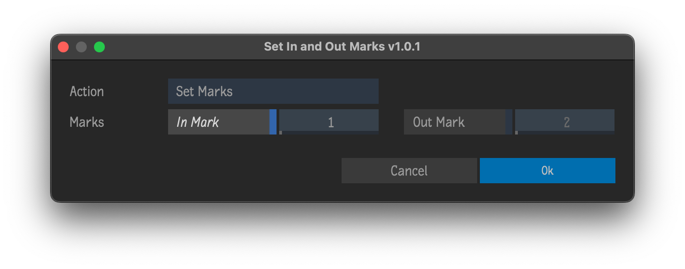

# Set In and Out Marks
Plugin for [Autodesk Flame software](http://www.autodesk.com/products/flame).

Set in/out or clear all marks on selected sequences.

## Compatibility
|Release Version|Flame Version|
|---|---|
|v3.X.X|Flame 2025 and up|
|v2.X.X|Flame 2022 up to 2024.2|
|v1.X.X|Flame 2021 up to 2021.2|

## Installation

### Flame 2025 and newer
To make available to all users on the workstation, copy `apply_text_timeline_fx_to_segments.py` to `/opt/Autodesk/shared/python/`

For specific users, copy `apply_text_timeline_fx_to_segments.py` to the appropriate path below...
|Platform|Path|
|---|---|
|Linux|`/home/<user_name>/flame/python/`|
|Mac|`/Users/<user_name>/Library/Preferences/Autodesk/flame/python/`|

### Flame 2021 up to 2024.2
To make available to all users on the workstation, copy `apply_text_timeline_fx_to_segments.py` to `/opt/Autodesk/shared/python/`

For specific users, copy `apply_text_timeline_fx_to_segments.py` to `/opt/Autodesk/user/<user name>/python/`

### Last Step
Finally, inside of Flame, go to Flame (fish) menu `->` Python `->` Rescan Python Hooks

## Menus
 - Right-click selected clips on the Desktop `->` Edit... `->` Set In and Out Marks
 - Right-click selected clips in the Media Panel `->` Edit... `->` Set In and Out Marks

## Acknowledgments
UI Templates courtest of [pyflame.com](http://www.pyflame.com)
